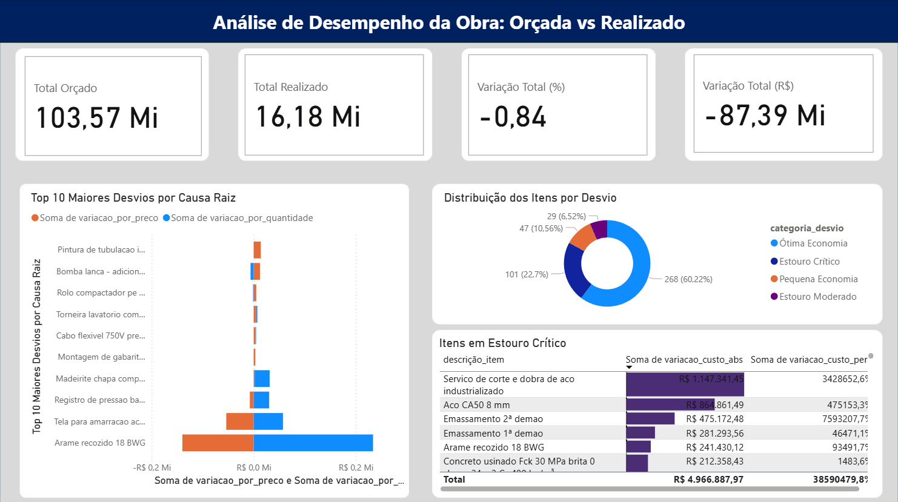

# Análise de Variação Orçamentária - Projeto de Obra



## 📋 Descrição

Este projeto realiza análise comparativa entre valores orçados e realizados em projetos de construção civil, identificando variações de custo por preço e quantidade, categorizando desvios e gerando insights para gestão de projetos.

## 🎯 Objetivos

- Comparar custos orçados vs realizados
- Identificar variações por preço e quantidade
- Categorizar desvios orçamentários
- Gerar base analítica para tomada de decisões
- Facilitar o controle financeiro de obras

## 📊 Funcionalidades

### Tratamento de Dados
- Limpeza e padronização de formatos numéricos
- Conversão de valores monetários (formato brasileiro para decimal)
- Normalização de nomes de colunas
- Preenchimento de valores ausentes

### Análises Realizadas
- **Variação Absoluta**: Diferença entre realizado e orçado
- **Variação Percentual**: Percentual de desvio do orçamento
- **Variação por Preço**: Impacto da diferença de preços unitários
- **Variação por Quantidade**: Impacto da diferença de quantidades

### Categorização de Desvios
- **Estouro Crítico**: > 10% acima do orçado
- **Estouro Moderado**: 0% a 10% acima do orçado
- **No Orçamento**: Exatamente conforme orçado
- **Pequena Economia**: 0% a 10% abaixo do orçado
- **Ótima Economia**: > 10% abaixo do orçado

## 🗂️ Estrutura dos Dados

### Arquivo de Entrada - Orçamento (`Base_Orcamento.csv`)
```
- Obra: Código da obra
- Grupo Orçamentário: Categoria do grupo orçamentário
- Cód. Estruturado: Código estruturado do item
- Cód. Item: Código único do item
- Descrição Item: Descrição detalhada do item
- Unid.: Unidade de medida
- Categoria: Categoria do material/serviço
- Qtde. Insumo: Quantidade orçada
- Custo Insumo: Custo unitário orçado
- Total Orçado: Valor total orçado
- Tipo: Tipo de item (Geral, específico, etc.)
```

### Arquivo de Entrada - Realizado (`Base_Realizado.csv`)
```
- Obra: Código da obra
- Cód. Estruturado: Código estruturado do item
- Cód. Item: Código único do item
- Descrição Item: Descrição detalhada do item
- Unid.: Unidade de medida
- Categoria: Categoria do material/serviço
- Nº NF: Número da nota fiscal
- Data NF: Data da nota fiscal
- ValorUnitRealizado: Valor unitário realizado
- Qtd Realizada: Quantidade realizada
- ValorTotalRealizado: Valor total realizado
- Cód. Fornecedor: Código do fornecedor
- Fornecedor: Nome do fornecedor
- Tipo: Tipo de item
- Cód. Pedido: Código do pedido
- Cód. Contrato: Código do contrato
```

### Arquivo de Saída (`Base_Analitica_Obra.xlsx`)
Todas as colunas originais mais:
```
- custo_total_orcado: Quantidade × Preço unitário orçado
- custo_total_realizado: Quantidade × Preço unitário realizado
- variacao_custo_abs: Diferença absoluta (Realizado - Orçado)
- variacao_custo_perc: Percentual de variação
- variacao_por_preco: Impacto da variação de preço
- variacao_por_quantidade: Impacto da variação de quantidade
- categoria_desvio: Classificação do desvio
```

## 🚀 Como Usar

### Pré-requisitos
```python
pandas>=1.3.0
numpy>=1.20.0
openpyxl>=3.0.0  # Para exportar Excel
```

### Instalação
```bash
pip install pandas numpy openpyxl
```

### Execução
1. Coloque os arquivos `Base_Orcamento.csv` e `Base_Realizado.csv` no mesmo diretório do notebook
2. Execute todas as células do notebook `main.ipynb`
3. O arquivo `Base_Analitica_Obra.xlsx` será gerado automaticamente

### Estrutura de Arquivos
```
projeto/
│
├── main.ipynb                 # Notebook principal
├── Base_Orcamento.csv        # Dados orçamentários (entrada)
├── Base_Realizado.csv        # Dados realizados (entrada)
└── Base_Analitica_Obra.xlsx  # Base analítica (saída)
```

## 📈 Exemplos de Análise

### Variação por Categoria
```python
# Análise por categoria de material/serviço
analise_categoria = df_final.groupby('categoria').agg({
    'custo_total_orcado': 'sum',
    'custo_total_realizado': 'sum',
    'variacao_custo_abs': 'sum'
}).round(2)
```

### Top Desvios
```python
# Maiores economias
maiores_economias = df_final[df_final['variacao_custo_abs'] < 0].nsmallest(10, 'variacao_custo_abs')

# Maiores estouros
maiores_estouros = df_final[df_final['variacao_custo_abs'] > 0].nlargest(10, 'variacao_custo_abs')
```

## 🔍 Interpretação dos Resultados

### Variações Positivas (Estouro)
- Custos acima do orçado
- Requer atenção e análise de causas
- Pode indicar problemas de planejamento ou execução

### Variações Negativas (Economia)
- Custos abaixo do orçado
- Representa eficiência ou oportunidades
- Pode indicar negociações bem-sucedidas

### Análise por Componente
- **Variação por Preço**: Diferenças nas negociações/mercado
- **Variação por Quantidade**: Diferenças na execução/necessidades

## 🛠️ Personalização

### Modificar Categorias de Desvio
```python
# Ajustar limites de classificação
conditions = [
    (df_final['variacao_custo_perc'] > 0.15),  # Novo limite para crítico
    (df_final['variacao_custo_perc'] > 0),     
    (df_final['variacao_custo_perc'] == 0),    
    (df_final['variacao_custo_perc'] < -0.05), # Novo limite para economia
    (df_final['variacao_custo_perc'] < 0)      
]
```

### Adicionar Novas Análises
```python
# Exemplo: Análise temporal
df_realizado['data_nf'] = pd.to_datetime(df_realizado['data_nf'], format='%d/%m/%Y')
df_realizado['mes_ano'] = df_realizado['data_nf'].dt.to_period('M')
```

## 📋 Limitações

- Requer que os códigos de item sejam consistentes entre orçamento e realizado
- Assume formato específico de entrada dos dados
- Não trata automaticamente variações de moeda
- Dados ausentes são preenchidos com zero

## 🔄 Melhorias Futuras

- [ ] Interface gráfica para visualização
- [ ] Relatórios automatizados em PDF
- [ ] Análise temporal de variações
- [ ] Alertas automáticos para desvios críticos
- [ ] Integração com sistemas ERP
- [ ] Dashboard interativo

## 📞 Suporte

Para dúvidas ou sugestões, entre em contato ou abra uma issue no repositório.

## 📄 Licença

Este projeto está sob licença MIT. Veja o arquivo LICENSE para mais detalhes.

---

**Desenvolvido para análise e controle orçamentário em projetos de construção civil** 🏗️
